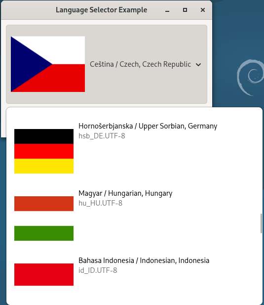

# gtkmm4-dropdown-language-selection

This small sample C++ code which demonstrate language selection dropdown for easy use in your app, this code is possible to build and run on Debian13 or on Windows in MSYS2 enviroment.

Building on Windows:
====================

1.) Install MSYS2
-----------------
Download and run the msys2 installer from http://msys2.github.io/ Tested only with the 64bit version. Make sure that the path you select for installation doesn’t contain any spaces.

2.) Start MSYS console
----------------------
Launch the Start Menu item “MSYS2 mingw 64 bit” you should be greeted with a console window. All steps below refer to what you should type into that window.

3.) Install updates
-------------------
Type:

   pacman -Syu

if it tells you to close restart msys, close the console window and start it again. Then run pacman -Syu again.

4.) Install dependencies
------------------------
Type/paste

   pacman -S \\ \
   mingw-w64-x86_64-gcc \\ \
   mingw-w64-x86_64-pkgconf \\ \
   mingw-w64-x86_64-gtkmm4 \\ \
   zip \\ \
   unzip \\ \
   git \\ \
   --needed

When prompted, just hit return. Sit back and wait for it to install what’s almost a complete linux environment.

Before continuing you may change to another directory. It easiest to type cd followed by a space and drop the folder you want to change to on the window.

5.) Clone gtkmm4-dropdown-language-selection by type/paste on commandline:
--------------------------------------------------------------------------

   git clone https://github.com/Peta-T/gtkmm4-dropdown-language-selection \
   cd gtkmm4-dropdown-language-selection
   
6.) Build it - type on command line:
------------------------------------

   g++ -std=c++17 main.cc languageselector.cc ./images/resources.c -o app $(pkg-config --cflags --libs gtkmm-4.0)

7.) Run app - type on command line:
-----------------------------------

   ./app

| Flag | Autonymum | Locale | English Name |
|------|-----------|--------|--------------|
|  | C | C.UTF-8 | C locale |
|  | Afaraf | aa_DJ.UTF-8 | Afar |
|  | Afrikaans | af_ZA.UTF-8 | Afrikaans |
|  | Aragonés | an_ES.UTF-8 | Aragonese |
|  | العربية | ar_AE.UTF-8 | Arabic (UAE) |
|  | العربية | ar_BH.UTF-8 | Arabic (Bahrain) |
|  | العربية | ar_DZ.UTF-8 | Arabic (Algeria) |
|  | العربية | ar_EG.UTF-8 | Arabic (Egypt) |
|  | العربية | ar_IQ.UTF-8 | Arabic (Iraq) |
|  | العربية | ar_JO.UTF-8 | Arabic (Jordan) |
|  | العربية | ar_KW.UTF-8 | Arabic (Kuwait) |
|  | العربية | ar_LB.UTF-8 | Arabic (Lebanon) |
|  | العربية | ar_LY.UTF-8 | Arabic (Libya) |
|  | العربية | ar_MA.UTF-8 | Arabic (Morocco) |
|  | العربية | ar_OM.UTF-8 | Arabic (Oman) |
|  | العربية | ar_QA.UTF-8 | Arabic (Qatar) |
|  | العربية | ar_SA.UTF-8 | Arabic (Saudi Arabia) |
|  | العربية | ar_SD.UTF-8 | Arabic (Sudan) |
|  | العربية | ar_SY.UTF-8 | Arabic (Syria) |
|  | العربية | ar_TN.UTF-8 | Arabic (Tunisia) |
|  | العربية | ar_YE.UTF-8 | Arabic (Yemen) |
|  | Asturianu | ast_ES.UTF-8 | Asturian |
|  | Беларуская | be_BY.UTF-8 | Belarusian |
|  | български език | bg_BG.UTF-8 | Bulgarian |
|  | भिल्ली | bhb_IN.UTF-8 | Bhili |
|  | brezhoneg | br_FR.UTF-8 | Breton |
|  | bosanski jezik | bs_BA.UTF-8 | Bosnian |
|  | Català | ca_AD.UTF-8 | Catalan (Andorra) |
|  | Català | ca_ES.UTF-8 | Catalan (Spain) |
|  | Català | ca_FR.UTF-8 | Catalan (France) |
|  | Català | ca_IT.UTF-8 | Catalan (Italy) |
|  | čeština | cs_CZ.UTF-8 | Czech |
|  | Cymraeg | cy_GB.UTF-8 | Welsh |
|  | dansk | da_DK.UTF-8 | Danish |
|  | Deutsch | de_AT.UTF-8 | German (Austria) |
|  | Deutsch | de_BE.UTF-8 | German (Belgium) |
|  | Deutsch | de_CH.UTF-8 | German (Switzerland) |
|  | Deutsch | de_DE.UTF-8 | German (Germany) |
|  | Deutsch | de_IT.UTF-8 | German (Italy) |
|  | Deutsch | de_LI.UTF-8 | German (Liechtenstein) |
|  | Deutsch | de_LU.UTF-8 | German (Luxembourg) |
|  | Ελληνικά | el_CY.UTF-8 | Greek (Cyprus) |
|  | Ελληνικά | el_GR.UTF-8 | Greek (Greece) |
|  | English | en_AU.UTF-8 | English (Australia) |
|  | English | en_BW.UTF-8 | English (Botswana) |
|  | English | en_CA.UTF-8 | English (Canada) |
|  | English | en_DK.UTF-8 | English (Denmark) |
|  | English | en_GB.UTF-8 | English (UK) |
|  | English | en_HK.UTF-8 | English (Hong Kong) |
|  | English | en_IE.UTF-8 | English (Ireland) |
|  | English | en_IN.UTF-8 | English (India) |
|  | English | en_NZ.UTF-8 | English (New Zealand) |
|  | English | en_PH.UTF-8 | English (Philippines) |
|  | English | en_SE.UTF-8 | English (Sweden) |
|  | English | en_SC.UTF-8 | English (Seychelles) |
|  | English | en_SG.UTF-8 | English (Singapore) |
|  | English | en_US.UTF-8 | English (USA) |
|  | English | en_ZA.UTF-8 | English (South Africa) |
|  | English | en_ZW.UTF-8 | English (Zimbabwe) |
|  | español; castellano | es_AR.UTF-8 | Spanish (Argentina) |
|  | español; castellano | es_BO.UTF-8 | Spanish (Bolivia) |
|  | español; castellano | es_CL.UTF-8 | Spanish (Chile) |
|  | español; castellano | es_CO.UTF-8 | Spanish (Colombia) |
|  | español; castellano | es_CR.UTF-8 | Spanish (Costa Rica) |
|  | español; castellano | es_DO.UTF-8 | Spanish (Dominican Rep.) |
|  | español; castellano | es_EC.UTF-8 | Spanish (Ecuador) |
|  | español; castellano | es_ES.UTF-8 | Spanish (Spain) |
|  | español; castellano | es_GT.UTF-8 | Spanish (Guatemala) |
|  | español; castellano | es_HN.UTF-8 | Spanish (Honduras) |
|  | español; castellano | es_MX.UTF-8 | Spanish (Mexico) |
|  | español; castellano | es_NI.UTF-8 | Spanish (Nicaragua) |
|  | español; castellano | es_PA.UTF-8 | Spanish (Panama) |
|  | español; castellano | es_PE.UTF-8 | Spanish (Peru) |
|  | español; castellano | es_PR.UTF-8 | Spanish (Puerto Rico) |
|  | español; castellano | es_PY.UTF-8 | Spanish (Paraguay) |
|  | español; castellano | es_SV.UTF-8 | Spanish (El Salvador) |
|  | español; castellano | es_US.UTF-8 | Spanish (USA) |
|  | español; castellano | es_UY.UTF-8 | Spanish (Uruguay) |
|  | español; castellano | es_VE.UTF-8 | Spanish (Venezuela) |
|  | Eesti keel | et_EE.UTF-8 | Estonian |
|  | euskara | eu_ES.UTF-8 | Basque (Spain) |
|  | euskara | eu_FR.UTF-8 | Basque (France) |
|  | Filipino | fil_PH.UTF-8 | Filipino |
|  | suomi | fi_FI.UTF-8 | Finnish |
|  | føroyskt | fo_FO.UTF-8 | Faroese |
|  | français; langue française | fr_BE.UTF-8 | French (Belgium) |
|  | français; langue française | fr_CA.UTF-8 | French (Canada) |
|  | français; langue française | fr_CH.UTF-8 | French (Switzerland) |
|  | français; langue française | fr_FR.UTF-8 | French (France) |
|  | français; langue française | fr_LU.UTF-8 | French (Luxembourg) |
|  | Gaeilge | ga_IE.UTF-8 | Irish |
|  | Gàidhlig | gd_GB.UTF-8 | Scottish Gaelic |
|  | Galego | gl_ES.UTF-8 | Galician |
|  | ગુજરાતી | gu_IN.UTF-8 | Gujarati |
|  | Gaelg | gv_GB.UTF-8 | Manx |
|  | עברית | he_IL.UTF-8 | Hebrew |
|  | हिन्दी | hi_IN.UTF-8 | Hindi |
|  | Hrvatski | hr_HR.UTF-8 | Croatian |
|  | hornjoserbšćina | hsb_DE.UTF-8 | Upper Sorbian |
|  | Magyar | hu_HU.UTF-8 | Hungarian |
|  | Bahasa Indonesia | id_ID.UTF-8 | Indonesian |
|  | íslenska | is_IS.UTF-8 | Icelandic |
|  | Italiano | it_CH.UTF-8 | Italian (Switzerland) |
|  | Italiano | it_IT.UTF-8 | Italian (Italy) |
|  | 日本語 | ja_JP.UTF-8 | Japanese |
|  | ქართული | ka_GE.UTF-8 | Georgian |
|  | Қазақ тілі | kk_KZ.UTF-8 | Kazakh |
|  | kalaallisut | kl_GL.UTF-8 | Greenlandic |
|  | ភាសាខ្មែរ | km_KH.UTF-8 | Khmer |
|  | ಕನ್ನಡ | kn_IN.UTF-8 | Kannada |
|  | 한국어 (韓國語) | ko_KR.UTF-8 | Korean |
|  | Kurdî | ku_TR.UTF-8 | Kurdish |
|  | Kernewek | kw_GB.UTF-8 | Cornish |
|  | Luganda | lg_UG.UTF-8 | Ganda |
|  | ພາສາລາວ | lo_LA.UTF-8 | Lao |
|  | lietuvių kalba | lt_LT.UTF-8 | Lithuanian |
|  | latgaliešu | ltg_LV.UTF-8 | Latgalian |
|  | latviešu valoda | lv_LV.UTF-8 | Latvian |
|  | Malagasy fiteny | mg_MG.UTF-8 | Malagasy |
|  | te reo Māori | mi_NZ.UTF-8 | Maori |
|  | македонски јазик | mk_MK.UTF-8 | Macedonian |
|  | മലയാളം | ml_IN.UTF-8 | Malayalam |
|  | Монгол | mn_MN.UTF-8 | Mongolian |
|  | Bahasa Melayu | ms_MY.UTF-8 | Malay |
|  | Malti | mt_MT.UTF-8 | Maltese |
|  | Norsk (bokmål) | nb_NO.UTF-8 | Norwegian Bokmål |
|  | Nederlands | nl_BE.UTF-8 | Dutch (Belgium) |
|  | Nederlands | nl_NL.UTF-8 | Dutch (Netherlands) |
|  | Nynorsk | nn_NO.UTF-8 | Norwegian Nynorsk |
|  | Norsk | no_NO.UTF-8 | Norwegian |
|  | Occitan | oc_FR.UTF-8 | Occitan |
|  | Afaan Oromoo | om_KE.UTF-8 | Oromo |
|  | Polski | pl_PL.UTF-8 | Polish |
|  | Português | pt_BR.UTF-8 | Portuguese (Brazil) |
|  | Português | pt_PT.UTF-8 | Portuguese (Portugal) |
|  | română | ro_RO.UTF-8 | Romanian |
|  | русский язык | ru_RU.UTF-8 | Russian |
|  | русский язык | ru_UA.UTF-8 | Russian (Ukraine) |
|  | slovenčina | sk_SK.UTF-8 | Slovak |
|  | slovenščina | sl_SI.UTF-8 | Slovenian |
|  | Soomaali | so_DJ.UTF-8 | Somali (Djibouti) |
|  | Soomaali | so_KE.UTF-8 | Somali (Kenya) |
|  | Soomaali | so_SO.UTF-8 | Somali (Somalia) |
|  | Shqip | sq_AL.UTF-8 | Albanian |
|  | српски језик | sr_CS.UTF-8 | Serbian (deprecated) |
|  | seSotho | st_ZA.UTF-8 | Southern Sotho |
|  | Svenska | sv_FI.UTF-8 | Swedish (Finland) |
|  | Svenska | sv_SE.UTF-8 | Swedish (Sweden) |
|  | தமிழ் | ta_IN.UTF-8 | Tamil |
|  | Tulu | tcy_IN.UTF-8 | Tulu |
|  | тоҷикӣ | tg_TJ.UTF-8 | Tajik |
|  | ไทย | th_TH.UTF-8 | Thai |
|  | Tagalog | tl_PH.UTF-8 | Tagalog |
|  | Türkçe | tr_CY.UTF-8 | Turkish (Cyprus) |
|  | Türkçe | tr_TR.UTF-8 | Turkish (Turkey) |
|  | українська мова | uk_UA.UTF-8 | Ukrainian |
|  | O‘zbek | uz_UZ.UTF-8 | Uzbek |
|  | Tiếng Việt | vi_VN.UTF-8 | Vietnamese |
|  | Walon | wa_BE.UTF-8 | Walloon |
|  | isiXhosa | xh_ZA.UTF-8 | Xhosa |
|  | ייִדיש | yi_US.UTF-8 | Yiddish |
|  | 简体中文 | zh_CN.UTF-8 | Simplified Chinese (China) |
|  | 粤语 | zh_HK.UTF-8 | Cantonese (Hong Kong) |
|  | 简体中文 | zh_SG.UTF-8 | Simplified Chinese (Singapore) |
|  | 繁體中文 | zh_TW.UTF-8 | Traditional Chinese (Taiwan) |
|  | isiZulu | zu_ZA.UTF-8 | Zulu |

